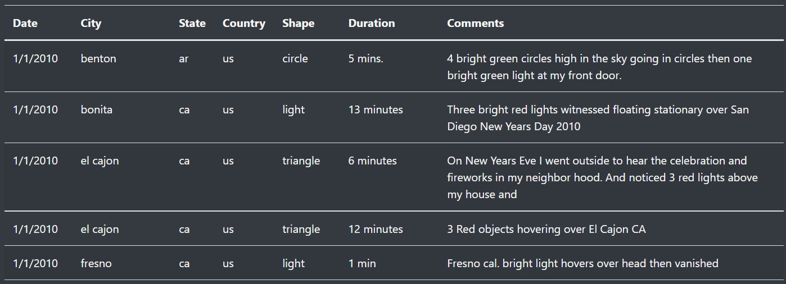

# UFO Sightings
## Project Overview
Are we alone in the universe? Many who study the stars believe that humanity is just one small part of a much larger equation. With this project, we have gathered a collection of UFO sightings from around the world to help answer this mystery. 

## Results
We began our project by using JavaScript and HTML to import our dataset into a table:

Once our table was complete, we added search features using D3 to listen for user input and filter the data based on that input:

## Summary
The site looks good and the filters work well, however the scope of the data is limited to a few months in 2010. We would love to update our dataset to include additional sightings over the years. Then, once our site is complete, users will be able to search through the UFO sighting data using several different criteria and decide for themselves whether humanity is truly alone! 